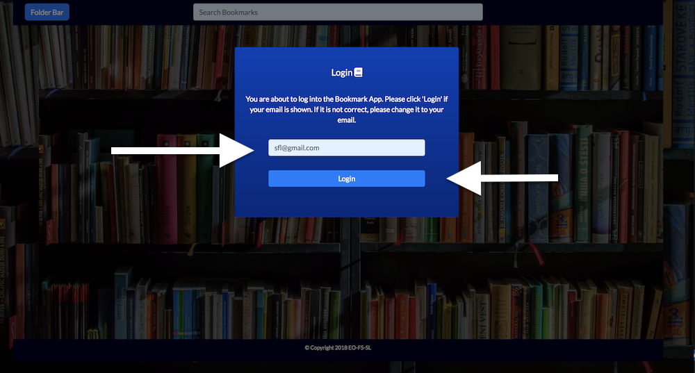
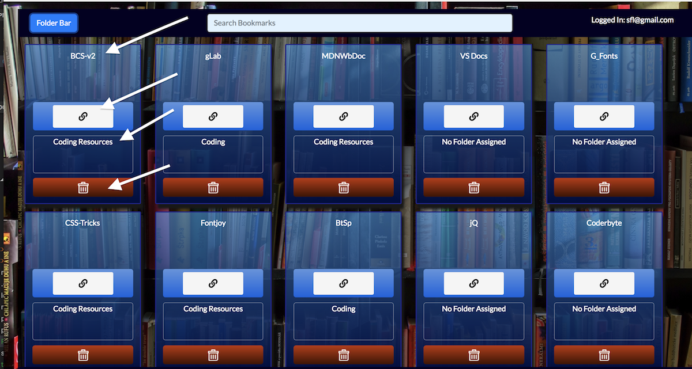
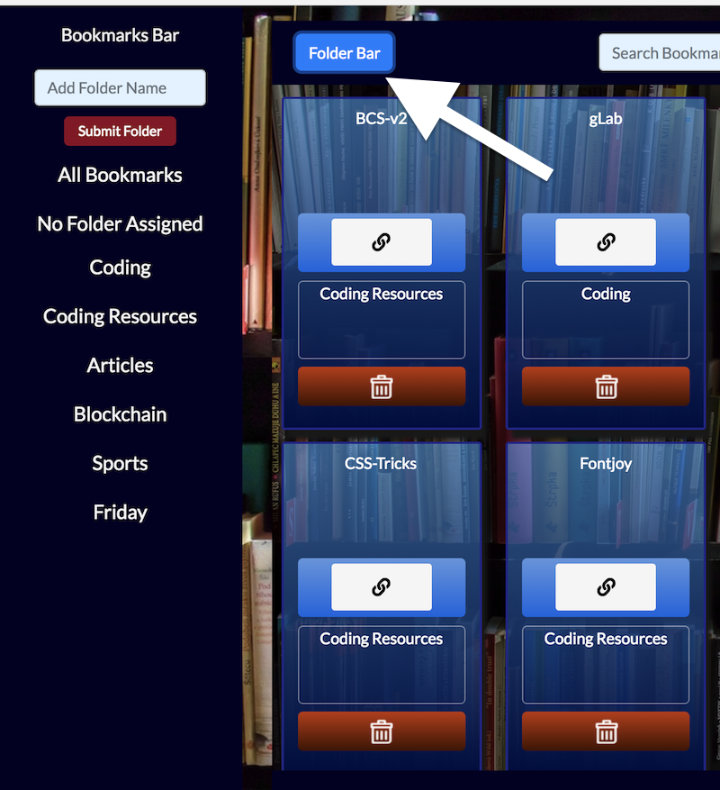
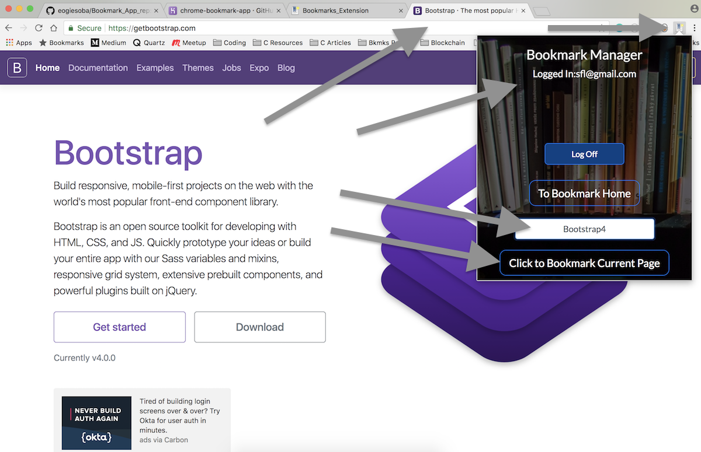

# Bookmark_Extension

<https://chrome-bookmark-app.herokuapp.com/> \
Version 1.0 \
Deployment Date: March 20, 2018  \
Contributors: Efosa Ogiesoba, Faizan Salman & Susan Lippa

#Purpose

Bookmark_Extension is an application that makes a database copy of your Google Chrome bookmarks and then renders them in a personal library.  From the library you can search for a Bookmark by its title, access a bookmark's web page,  create folders, assign the folders to the bookmarks and then sort them accordingly. 

Bookmark's can be deleted from your library, but to new bookmarks must be created from the Bookmark_Extension's Chrome icon. 

#Getting Started

In order to use the Bookmark_Extension, you will need to install our Chrome extension.

Until we publish on the Chrome Extension Store, you will need to clone our Github repository to your desktop.

To clone the repository, visit <https://github.com/eogiesoba/Bookmark_App_rep>

Once the repository is cloned to your computer, open Google Chrome and visit   <chrome://extensions/>

From there, make sure "Developer Mode" is on, and then click "Load Unpacked" 

Using the Finder, navigate to the repository file and click "Select". 

The Bookmark Extension will be loaded onto you Extension list and the Bookmark Extension icon will appear next to your Chrome search bar. 

Click the icon and you are on your way.

#Instructions

Once you have loaded and clicked the Bookmark_Extension icon, the following window will appear:

You will need to:

1) Input your Gmail address - this register's your email to our database. It becomes your login going forward. Going forward, your email should be saved so you should not have to enter it into this page again. 

2) Click the 'Register/Login' button - this downloads your bookmarks into our database.

3) Click the 'To Bookmark Home' button - this will take you to your Bookmark_Extension library.

Once you click on the 'To Bookmark Home' button, the following modal will appear. We ask you to input the same email that you used to register on the Chrome extension page. This allows us to link the bookmarks that were downloaded to the display you are about to see.

Once you complete this second login, you will be taken to the main Bookmark_Extension homepage. Here you will see a rendering of all your bookmarks. Each bookmark is comprised of 4 sections: the title, the on-click to take you to the web page, the folder section and the delete section. 

The title section is searchable using the search bar located at the top of the home page.

You will notice that the bookmarks originally render with "No Folder Assigned". To create and assign folders you must first click on the 'Folder Bar' button located in the upper left hand corner of the homepage. You can click on the 'Folder Bar' button again to hide the folder section. 

At the beginning, you will notice that no folder exist. To create a Folder, type the folder name in the 'Add Folder Name' bar and click submit. Your new folder will be added to the list. 

Once folder have been created, you can assign them to bookmarks by dragging the line of the folder over into the green folder section on the bookmark. To view bookmarks assigned to a particular folder, just click on the folder line.

To create a new bookmark, you must return to the Bookmark_Extension Chrome extension. First make sure your active tab in Chrome is the one you want to bookmark then click on the original Bookmark-Extension icon. When the extension window opens you will notice that the application recognizes you as logged in. To add a new Bookmark, first add a title for the bookmark in the form area. Then press "Click to Bookmark Current Page". This will save the bookmark and return you to your library. Your new bookmark will be rendered at the bottom of the bookmark list. 

That is all there is too it. Enjoy using our Bookmark_Extension.

#Built Using

Chrome Extension:  <https://developer.chrome.com/extensions/getstarted> \
Bootstrap 4:  <https://getbootstrap.com/> \
StartBootstrap Simple Sidebar: <https://startbootstrap.com/template-overviews/simple-sidebar/>

#Original Contributors

Efosa Ogiesoba: <https://github.com/eogiesoba> \
Faizan Salman: <https://github.com/Faizy711> \
Susan Lippa: <https://github.com/slippa91>

#Idea

The idea originally began with Efosa Ogiesoba. He was interested in a more visual and dynamic way to work with his Chrome bookmarks. This corresponded well with a project that required database integration. And, although working with a Chrome Extension has presented some developmental challenges, it has ultimately been a rewarding experience. 

#IceBox

There are several ideas pending for possible future development.

1) Integrating the login between the Extension and the home page.
2) Evolving the codebase to React.js to allow for individual rendering of the bookmark and folder elements.
3) Adding a 'Notes' feature.
4) Allow a bookmark to exist in multiple folders.

# Ideas for Improvement:

Have additional ideas for improving this site? Please first discuss the change you wish to make via email with the owners of this repository. Email addresses can be found on the contributor's gitHub pages (links above).

