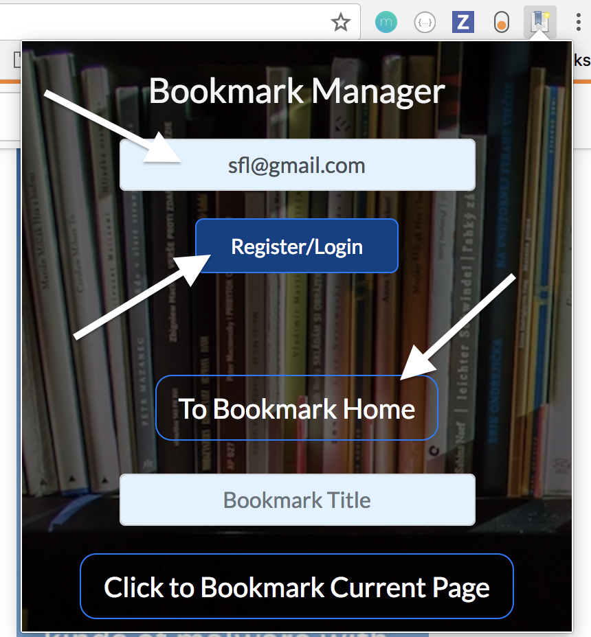
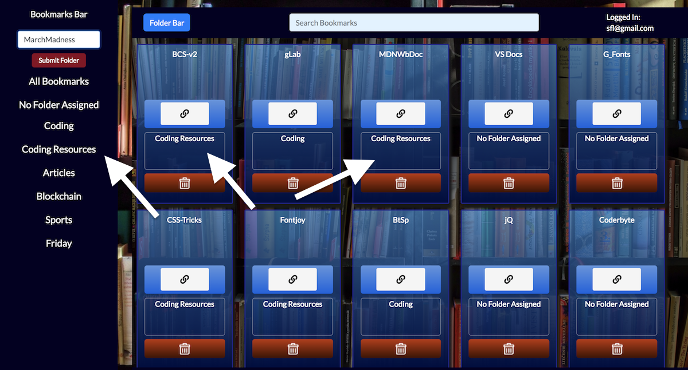

# Bookmark Extension

\
<https://chrome-bookmark-app.herokuapp.com/> \
Version 1.0 \
Deployment Date: March 20, 2018  \
Contributors: Efosa Ogiesoba, Faizan Salman & Susan Lippa

\
#Purpose

Bookmark Extension is an application that makes a database copy of your Google Chrome bookmarks and organizes them in a personal library.  From the library you can search for a Bookmark by its title, access a bookmark's web page,  create folders, assign the folders to bookmarks and sort them accordingly.  

# Getting Started

\
In order to use the Bookmark Extension, you must first install our Chrome extension.

Go to the Chrome Extension Web Store using the following link and click 'Add to Chrome'.

\
<a href="https://chrome.google.com/webstore/detail/bookmarksextension/bmcedhkdcpghcododeoabjphojpigcoe?hl=en-US&gl=US" target="_blank">Chrome Extension Load URL</a>

\

\
A alert will pop up asking you to confirm the Extension load. Click 'Add Extension".

\

\
A second popup will appear when the Extension has been loaded. Click on the 'X' in the upper right hand corner of the box to close it.  You will notice that a blue book icon will appear to the right of your Chrome search bar. You are now ready to begin using the Bookmark Extension. 

\

# Instructions

\
#Login

\
To start, click the Bookmark Extension icon located in the upper right hand corner of your Chrome Window.

\

\
The following window will appear.

\

\
You will need to:

1) Input your Gmail address - This registers your email to the database. It becomes your login going forward. Your email will be saved so you should not have to re-enter it into this page. 

2) Click the 'Register/Login' button - This downloads your bookmarks into the database.

3) Click the 'To Bookmark Home' button - This will take you to your Bookmark Extension library.

\

\
When the 'To Bookmark Home' button is clicked, the following modal will appear. We ask you to input the same email that you used to register on the Chrome extension page. This allows us to link the bookmarks that were downloaded to the display you are about to see.

\

\
\
#Bookmarks

\
From the modal login, you will be taken to the main Bookmark Extension homepage. Here you will see a rendering of all your bookmarks. Each bookmark is comprised of four sections: the title, the web page link, the folder section and the delete button. 

\

\
The title section is searchable using the input bar located at the top of the home page.

\

\
To create a bookmark, make sure your active tab in Chrome is the one you want to bookmark then click on the original Bookmark Extension icon. 

When the extension window opens you will notice that the application recognizes you as logged in. 

To add a new bookmark, first add a title for the bookmark in the form area. Then press "Click to Bookmark Current Page". This will save the bookmark to the database. To access your new bookmark, click the 'To Bookmarks Home' button. The modal will reappear and ask to reconfirm your login. Your new bookmark will be rendered at the bottom of the bookmark list. 

\

\
\
#Folders

\
 To access the 'Folder' section of the Bookmark Extension, click on the 'Folder Bar' button located in the upper left hand corner of the home page.  Click the 'Folder Bar' button again to hide the folder section. 

\
At this time, we are not able to import your existing Chrome bookmark folders. All bookmarks are uploaded with the 'No Folder Assigned' tag. To create a folder, type the folder name in the 'Add Folder Name' bar and click submit. Your new folder will be added to the list. 

\
Once a folder has been created, you can assign it to a bookmark by dragging the folder name over into the appropriate section of the bookmark. 

\

\
To search by a particular folder, just click on the name and all the bookmarks with that assignment will appear in the window.

\
To delete a folder, click on the minus sign to the left of the folder name. You will get an alert that will inform you that deleting a folder will also delete all of its associated bookmarks. If you do not wish to delete the bookmarks, you will have to reassign them to a different folder prior to deleting the folder.

\

\
That is all there is too it. Enjoy using our Bookmark Extension.

# Built Using

\
Chrome Extension:  <https://developer.chrome.com/extensions/getstarted> \
Bootstrap 4:  <https://getbootstrap.com/> \
StartBootstrap Simple Sidebar: <https://startbootstrap.com/template-overviews/simple-sidebar/>

# Original Contributors
 
 \
Efosa Ogiesoba: <https://github.com/eogiesoba> \
Faizan Salman: <https://github.com/Faizy711> \
Susan Lippa: <https://github.com/slippa91>

# Original Idea

\
The idea originally began with Efosa Ogiesoba. He was interested in a more visual and dynamic way to work with his Chrome bookmarks. This corresponded well with a project that required database integration, API calls and a polished UI. Although working with a Chrome Extension has presented some developmental challenges, it has ultimately been a rewarding experience. 

\

# IceBox

\
There are several ideas pending for possible future development.

1) Integrating the login between the Extension and the home page.
2) Adding a 'Notes' feature to each bookmark.
3) Allowing folders and bookmarks to be dynamically renamed.
4) Allowing folders to be deleted either with or without their corresponding bookmarks.
4) Allowing a bookmark to exist in multiple folders.
2) Evolving the codebase to React.js to allow for individual rendering of the bookmark and folder elements.

# Ideas for Improvement:

\
Have additional ideas for improving this site? Please first discuss the change you wish to make via email with the owners of this repository. Email addresses can be found on the contributor's gitHub pages (links above).

